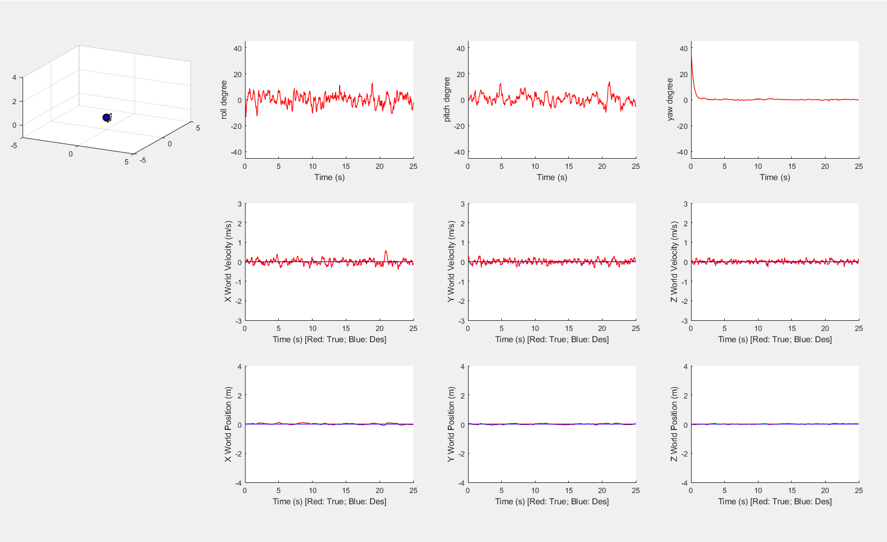
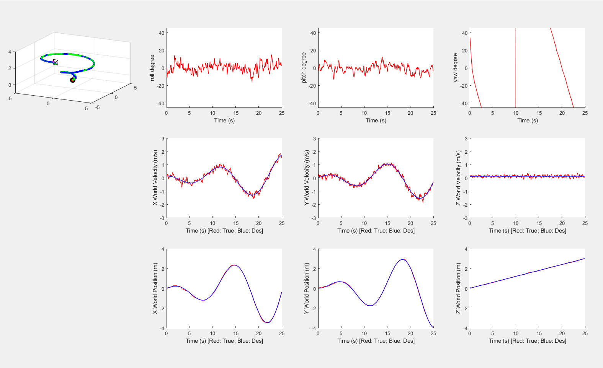
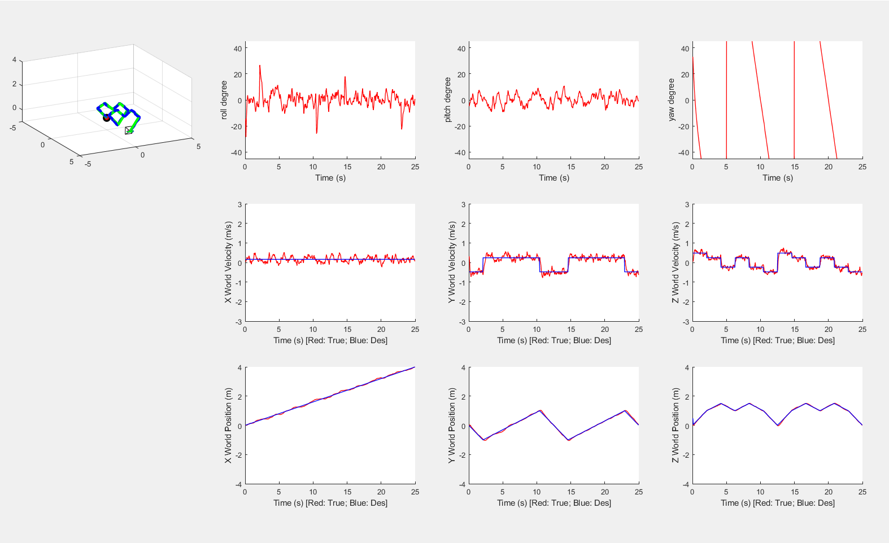

# ELEC5660 Project 1 Phase 1 Report

LIANG, Yuchen Eric (20582717)

## Plot by simulator

### Hovering

### Circle trajectory

### Heart trajectory

## Controller statistics
### PID parameters
|    	| x 	| y  	| z  	| roll 	| pitch 	| yaw  	|
|----	|---	|----	|----	|------	|-------	|------	|
| Kp 	| 8 	| 10 	| 18 	| 2000 	| 2000  	| 2000 	|
| Kd 	| 4 	| 6  	| 9  	| 70   	| 70    	| 70   	|

## Result analysis
### RMS error
| RMS error 	| x      	| y      	| z      	| v_x    	| v_y    	| v_z    	| phi    	| theta  	| psi    	|
|-----------	|--------	|--------	|--------	|--------	|--------	|--------	|--------	|--------	|--------	|
| Hovering  	| 0.0391 	| 0.0285 	| 0.0170 	| 0.1309 	| 0.1070 	| 0.0779 	| 0.0368 	| 0.0337 	| 0.0611 	|
| Circle    	| 0.0418 	| 0.0349 	| 0.0190 	| 0.1362 	| 0.1119 	| 0.0812 	| 0.0349 	| 0.0373 	| 0.0623 	|
| Heart     	| 0.0375 	| 0.0365 	| 0.0204 	| 0.1273 	| 0.1315 	| 0.0909 	| 0.0401 	| 0.0390 	| 0.0620 	|

The result is acceptable though there are some oscillations and also some overshoot. The PID parameters is tuned using the Ziegler-Nichols method. Given more time and patience, the parameters should be able to achieve better performance.

## Others
