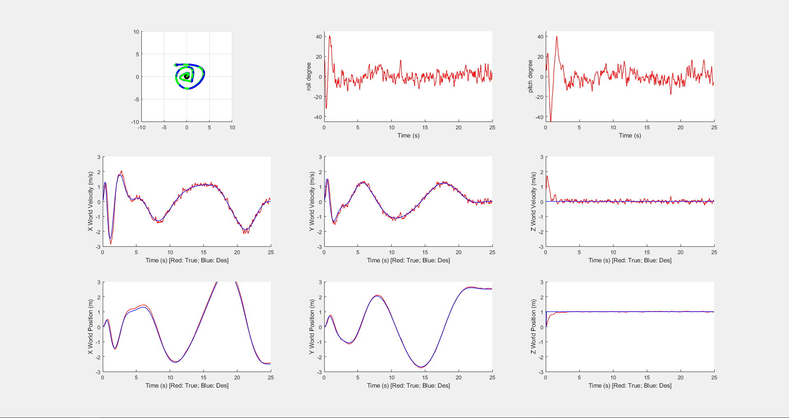
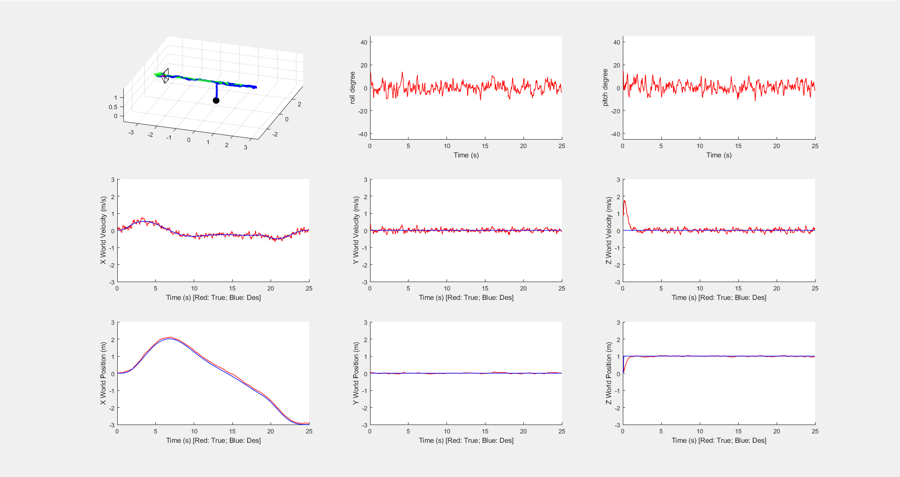
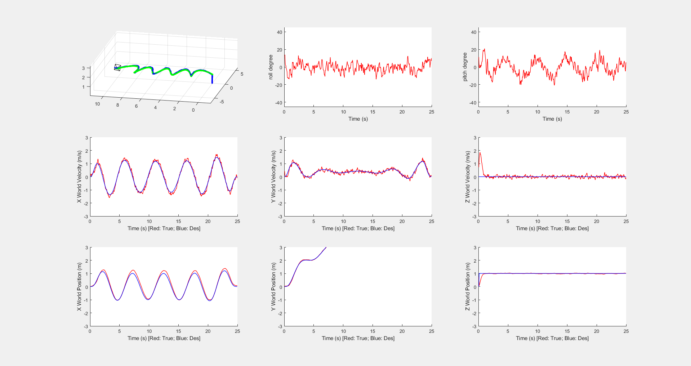

# ELEC5660 Project 1 Phase 2 Report

LIANG, Yuchen Eric (20582717)

## Method used
This report is using the quadprog function provided by matlab to do the optimization of the constrained QP problem.

## Plotted figures

#### path1

#### path2

#### path3

## Controller statistic

#### Change in PID parameter
The PID parameter in the previous phase is not stiff enough. Change a bit to make the drone more responsive.
|    	| x 	| y  	| z  	| roll 	| pitch 	| yaw  	|
|----	|---	|----	|----	|------	|-------	|------	|
| Kp 	| 10 	| 10 	| 20 	| 3200 	| 3200  	| 3200 	|
| Kd 	| 8 	| 8  	| 8  	| 90   	| 90    	| 90   	|

#### RMS Error
| RMS error 	|    x   	|    y   	|    z   	|   v_x  	|   v_y  	|   v_z  	|   phi  	|  theta 	|   psi  	|
|:---------:	|:------:	|:------:	|:------:	|:------:	|:------:	|:------:	|:------:	|:------:	|:------:	|
| path1     	| 0.1230 	| 0.0534 	| 0.1128 	| 0.1859 	| 0.1393 	| 0.2183 	| 0.0494 	| 0.0494 	| 0.0234 	|
| path2     	| 0.0872 	| 0.0221 	| 0.1072 	| 0.0902 	| 0.0899 	| 0.2369 	| 0.0469 	| 0.0466 	| 0.0225 	|
| path3     	| 0.1380 	| 0.0359 	| 0.1065 	| 0.1420 	| 0.1007 	| 0.2440 	| 0.0458 	| 0.0474 	| 0.0229 	|

## Time allocation strategies

Two time allocation strategies are used in this report. The first one is allocate the time equally using number of waypoints. The second one is allocate the time according to the distance between waypoints.

For the path given in the project, less difference can be seen between the two strategies since the distance between waypoints are not significant. However, for the path with more waypoints and waypoints with larger distance difference, the first strategy will cause the drone to fly too fast.

## Result analysis
The result is acceptable, for the simulator and proposed trajectory, the drone can followed quite well.

## Others
Don't open copilot when you are typing equations. It will add/delete things behind your back.