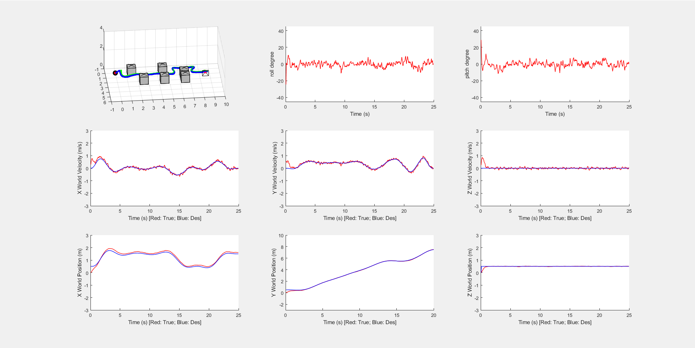
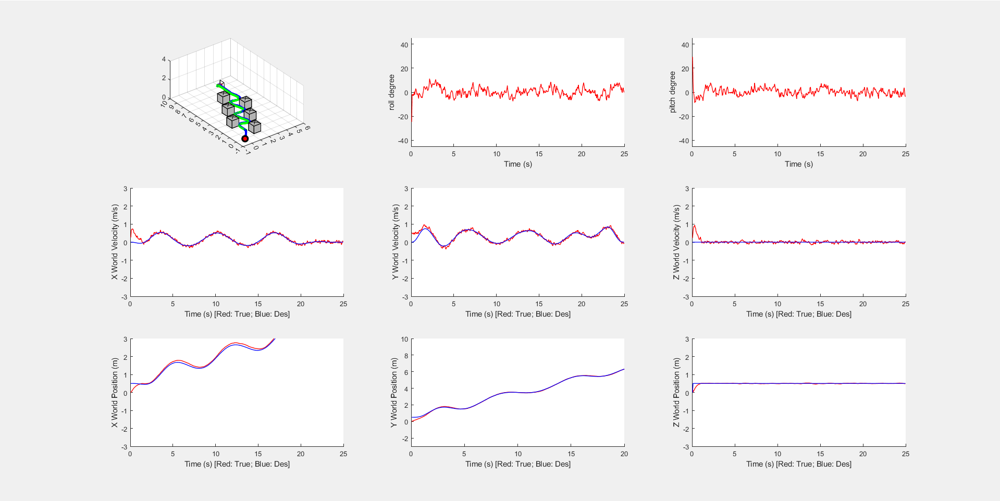
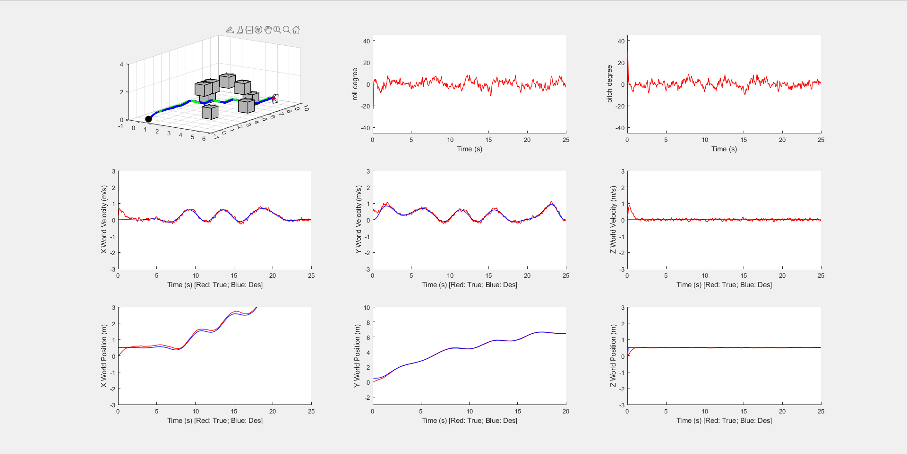

# ELEC5660 Project 1 Phase 3 Report

LIANG, Yuchen Eric (20582717)

## Figures

#### Map1

#### Map2

#### Map3(random)

## Analysis
Under this lab's context, the heuristic function help the algorithm to know which node is leading towards the target. This allow the algorithm to be divided less from the main route making it more efficient while also being able to find the optimal route.
This report tried two different kind of heuristic function. One is the manhattan distance, the other is the euclidean distance. In map 2, when using manhattan distance the route is not optima due to the special setting of the obstacles. However, the euclidean distance can find the optimal route. In map 1, both heuristic function can find the optimal route.

## Others
The grid can be smaller actually, the route is kind of squared due to we analyze it using grid, therefore the route doesn't look quite smooth in general. 