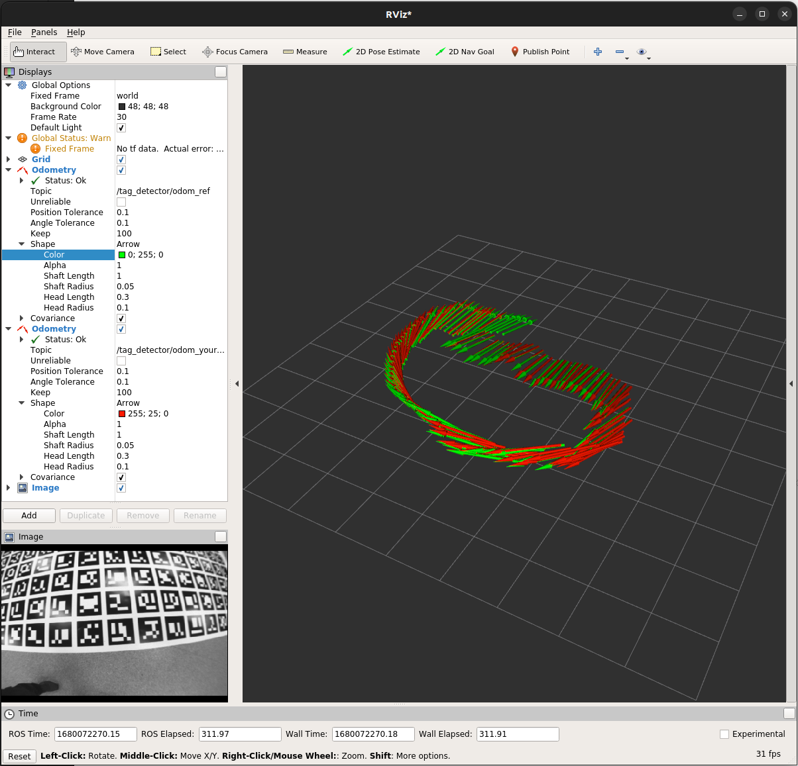

# ELEC5660 Project 2 Phase 1 Report

LIANG, Yuchen Eric (20582717)

## Figures plotted by rviz

Green is the ref odemetry
Red is my work obemetry

## Statics about the result
R matrix RMS Error = 1.2171*10^-5

T matrix RMS Error = 3.74318*10^-5

## Descriptions about your implementation.
#### Docker environment:
As I stated in the issue, I did not use the VNC machine. The toolchain I setup seems to be working fine. I am using also the VSCode docker extension which makes attach to docker, doing docker operation and editing the file in the docker much easier.

#### Implementation
The main pipeline is initializing the K and A matrix by using the K and t given, and tansfer from cv element to eigen element. Then define A using the pts and the equation in the lectrue notes where you need to solve Ax=0 using JacobiSVD to get the x matrix. After which H^ can be defined and process to define the related element and solve the USV svd problem. At last R and T can be calculated out.

#### Hacking
I add `#include <opencv2/core/eigen.hpp>` to the in the include list to let the cv::undistortPoints work since it keep poping error telling me that it is not found in the opencv package.

## Others
RVIZ Fixed Frame need to be changed to 'world' to visualize properly.
