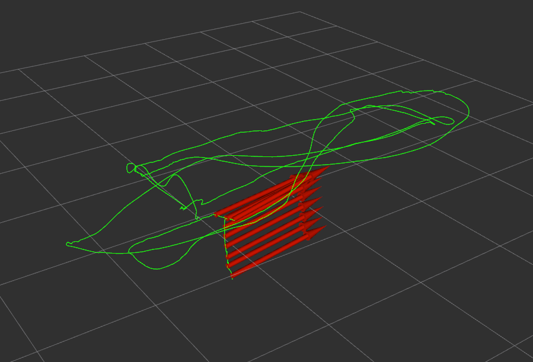

# ELEC5660 Project 2 Phase 2 Report

LIANG, Yuchen Eric (20582717)

## Figures of the estimated path
<p align="center">

</p>

## Descriptions about your implementation
#### Docker environment:
Error message when catkin_make:
```
/usr/bin/ld: cannot find -ldw
collect2: error: ld returned 1 exit status
stereo_vo/stereo_vo_estimator/CMakeFiles/stereo_vo.dir/build.make:227: recipe for target '/home/workspace/devel/lib/stereo_vo/stereo_vo' failed
make[2]: *** [/home/workspace/devel/lib/stereo_vo/stereo_vo] Error 1
CMakeFiles/Makefile2:1086: recipe for target 'stereo_vo/stereo_vo_estimator/CMakeFiles/stereo_vo.dir/all' failed
make[1]: *** [stereo_vo/stereo_vo_estimator/CMakeFiles/stereo_vo.dir/all] Error 2
Makefile:138: recipe for target 'all' failed
make: *** [all] Error 2
Invoking "make -j12 -l12" failed
```
Potential issue with `stereo_vo/stereo_vo_estimator/CMakeLists.txt` line 70.
solved by Comment `-ldw` or run `sudo apt install libdw-dev`

#### Implementation
Feature detection is done using cv::goodFeaturesToTrack. The parameters are tuned to get a good result by eyeballing. The parameters are:
```
int MaxCorners = 400;
double QualityLevel = 0.03;
double MinDistance = 12.0;
int BlockSize = 15;
```
Optical flow is done using LK method using cv::calcOpticalFlowPyrLK. PNP problem is solved using cv::solvePnPRansac, tuned the parameter a bit, iteration 10000, reprojection error 1.0, confidence 0.99. Changing this parameter does not affect much the problem mentioned in the next session.

#### Hacking
Cannot get things working without implementing rejectF from vins-mono (or cv::findFundamentalMat), I think it should be ok not using it, but did not figure out at last (maybe need more tuning for the parameters in solvePnPRansac). The sypmtom is that the estimated path will jump far far away at some point and the rotation matrix and translation matrix get corrupted. This is solved by adding the rejectWithF from vins-mono in Estimator::trackFeatureBetweenFrames.

## Others
RVIZ Fixed Frame need to be changed to 'world' to visualize properly.