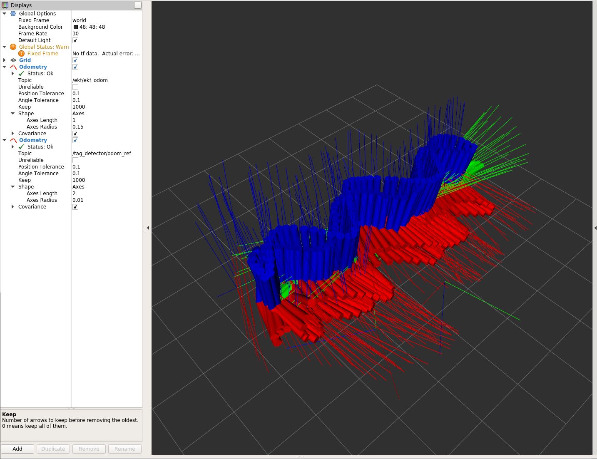
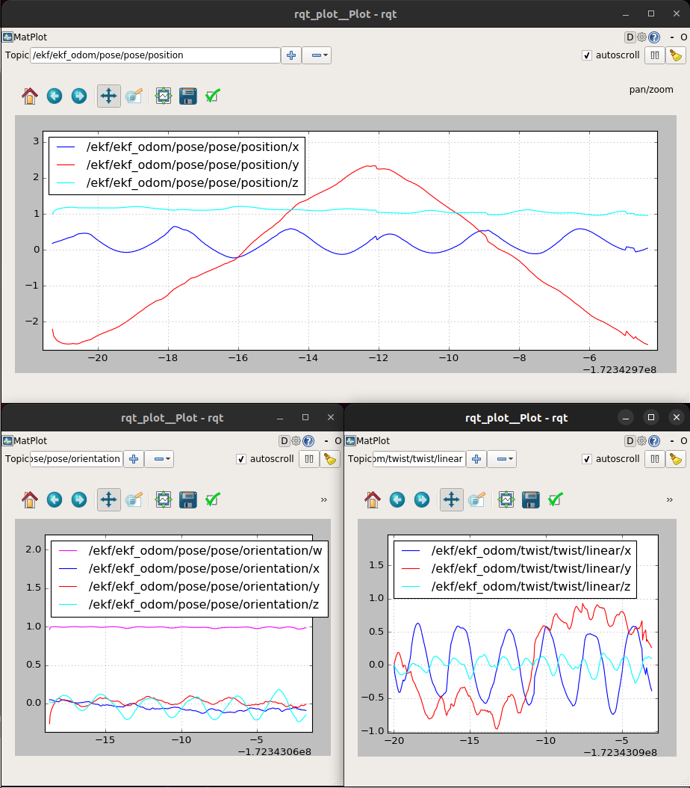

# ELEC5660 Project 3 Phase 1 Report

LIANG, Yuchen Eric (20582717)

## Figures plotted by rqt plot and rviz
<p align="center">

</p>

<p align="center">

</p>

## Descriptions about your implementation
#### imu_callback
According to the lectuee notes. I divided the code into several step. Assumptions, Linearization, Discretization, Update mean and Update covariance.
The timer is set to current timestamp and if the timer is not defined (0), imu_callback will be skipped. All relevant variables are get from the imu message. Then the fomula on the lecture note is implemented. Part of the code here is copied from student from previous years due to limit of time. But the code is generally implementing the fomula in matlab and translated to c++. The copied code is commented. U_t and A_t is calculated. Then the mean and covariance is updated later. And at last the last_imu_time_stamp is set to current timestamp.

#### odom_callback
According to the lectrue notes. I divided the code into several step. Assumptions, Linearization and Update. In this part, VO poses measured using tag detector is used to update IMU prior as shown on the lecture note. And at last, a topic is published to show the result.

## Others
Originally, I found that the frame of tag_odom_ref and the ekf is not the same, so I tried to the frame when the odometry is published. 
```
ekf_odometry.pose.pose.orientation.y = -Q_ekf.y();
ekf_odometry.pose.pose.orientation.z = -Q_ekf.z();
```
However, it did not work. So I changed the R_ekf y and z element directly instead.
```
Eigen::Matrix3d R_ekf;
R_ekf << cos(state(5))*cos(state(4))- sin(state(3))*sin(state(5))*sin(state(4)), 
        -cos(state(3))*sin(state(5)), 
        cos(state(5))*sin(state(4))+cos(state(4))*sin(state(3))*sin(state(5)),
        -(cos(state(4))*sin(state(5))+cos(state(5))*(sin(state(3)))*sin(state(4))), 
        -(cos(state(3))*cos(state(5))), 
        -(sin(state(5))*sin(state(4))-cos(state(5))*sin(state(3))*cos(state(4))),
        -(-cos(state(3))*sin(state(4))), 
        -(sin(state(3))), 
        -(cos(state(3))*cos(state(4)));
```
Hopefully this does not affect the latter project. Will try to fix it later.