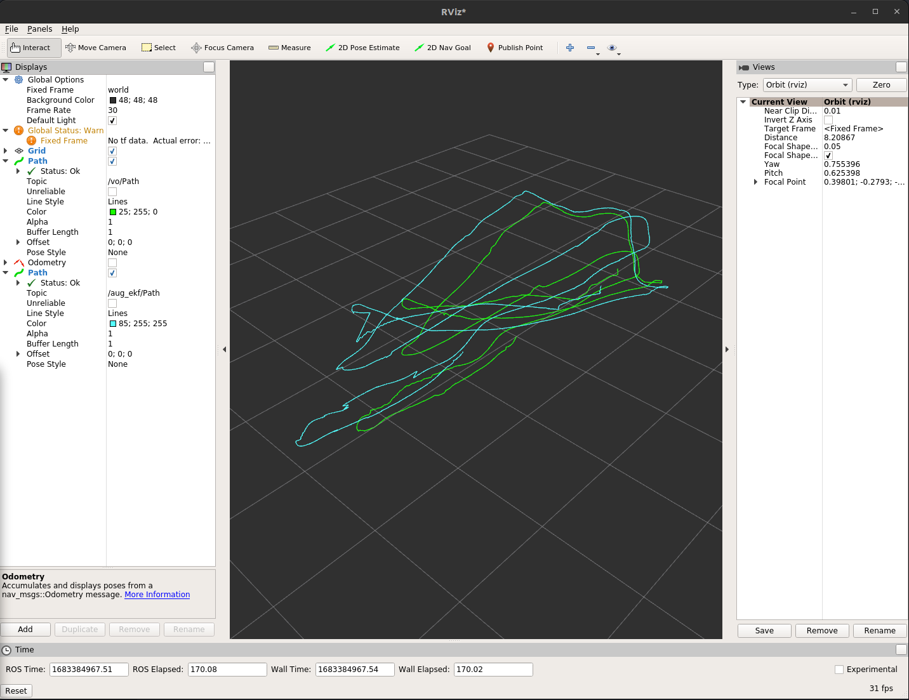
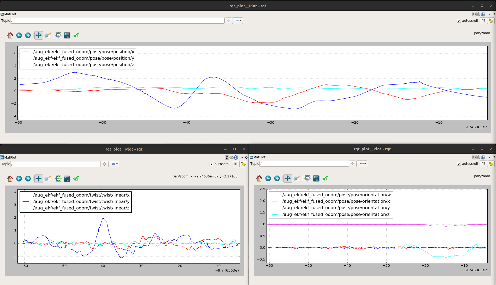

# ELEC5660 Project 3 Phase 2 Report
LIANG, Yuchen Eric (20582717)

## Figures plotted by rqt plot and rviz

## Descriptions about your implementation

The structure of the code is shown in the flowcharts. The model is implementated based on the lecture notes. Some code is generate by Autograd from matlab. The calculation did not work, so don't bother looking at it.

## others
### Environment issues
- Ceres solver 1.14.0 is installed in the docker image. The installation followed https://zhuanlan.zhihu.com/p/151675712
- Files copied from previous assignment (tag_detector and stereo_vo_estimator)
- aruco-1.2.4 is also added to the src folder
- libdw is installed
- Type `auto` is used in the scripts, please use C++11 or higher version to compile the code

### Bugs  
Found a lot of bugs in stereVO, list some that I can remember when writing this document:
- Bugs in stereoVO `Estimator::trackFeatureBetweenFrames`
- Not using parameters in stereoVO parameters.yaml
- `Estimator::updateLatestStates` not updating `latest_rel_P` and `latest_rel_Q`
- stereoVO node not publishing rel_pose, therefore ekf_filter can not get the data. Add `rel_pose_pub_.publish(rel_pose);`
- Too many can't remember ......