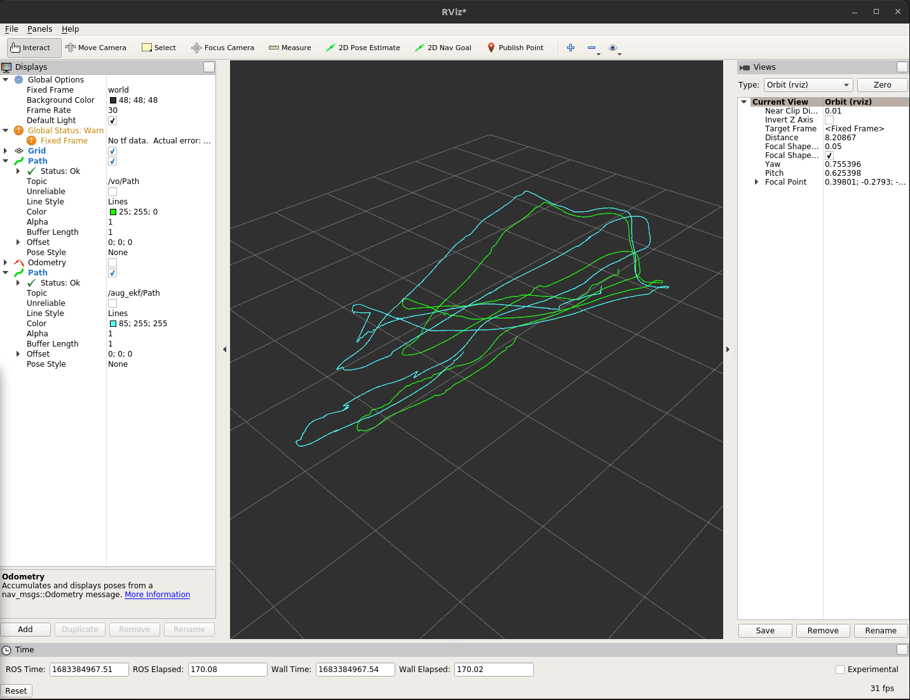
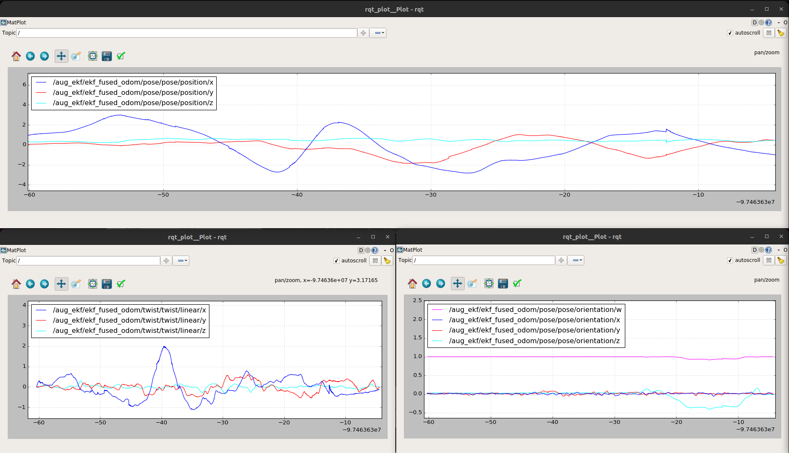
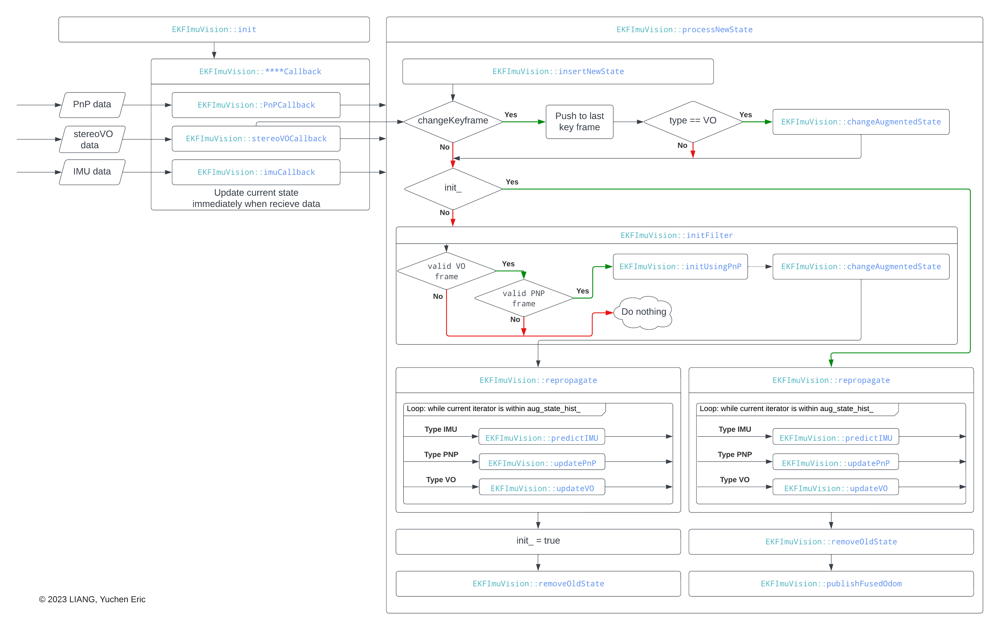

# ELEC5660 Project 3 Phase 3 Report
LIANG, Yuchen Eric (20582717)

## Figures plotted by rqt plot and rviz

## Descriptions about your implementation

The structure of the code is shown in the flowcharts. The model is implementated based on the lecture notes. Some code is generate by Autograd from matlab. The calculation did not work, so don't bother looking at it.

## Implementation
- setup docker environment [this method](https://github.com/HKUST-Aerial-Robotics/HKUST-ELEC5660-Introduction-to-Aerial-Robotics/issues/1) or use your own docker envionrment and install ubuntu 16.04 and ros kinetic. Remember to link the container to the source file.
- source ros setup.bash file for each terminal or write it inside .bashrc `source /opt/ros/kinetic/setup.bash`
- check whether eigen and ceres is installed, if not, install and make it follow [this link](https://zhuanlan.zhihu.com/p/151675712). (The dependencies can be found [here](https://gist.github.com/JihongJu/97af193dd9334497b1916862caf0c467))
- make arUco follow the README in aruco-1.2.4 
- If libdw not installed `sudo apt install libdw-dev`
- `cd /home/workspace` and `catkin_make`
- `source devel/setup.bash`
- `roslaunch aug_ekf augekf.launch`

## others
### Environment issues
- Ceres solver 1.14.0 is installed in the docker image. The installation followed [this link](https://zhuanlan.zhihu.com/p/151675712)
- Files copied from previous assignment (tag_detector and stereo_vo_estimator)
- aruco-1.2.4 is also added to the src folder
- libdw is installed
- Type `auto` is used in the scripts, please use C++11 or higher version to compile the code

### Bugs  
Found a lot of bugs in stereVO, list some that I can remember when writing this document:
- Bugs in stereoVO `Estimator::trackFeatureBetweenFrames`
- Not using parameters in stereoVO parameters.yaml
- `Estimator::updateLatestStates` not updating `latest_rel_P` and `latest_rel_Q`
- stereoVO node not publishing rel_pose, therefore ekf_filter can not get the data. Add `rel_pose_pub_.publish(rel_pose);`
- there are also bugs in tag_detector, the odom_ref is published directly with out any calculation.
- Too many can't remember ......
