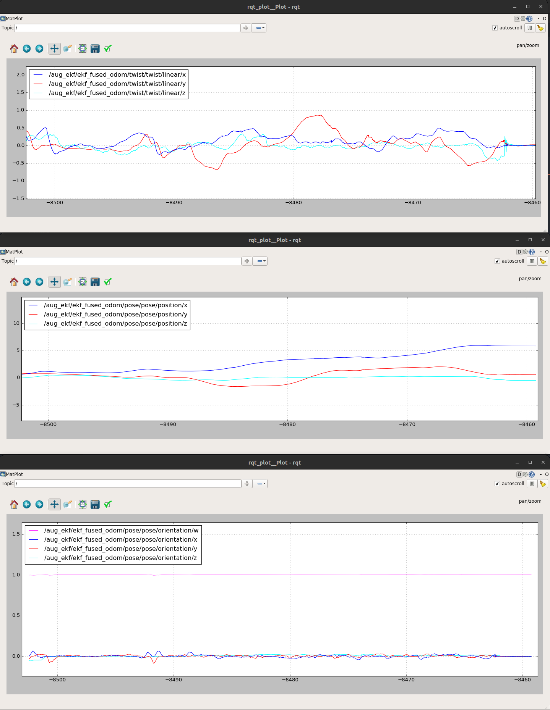
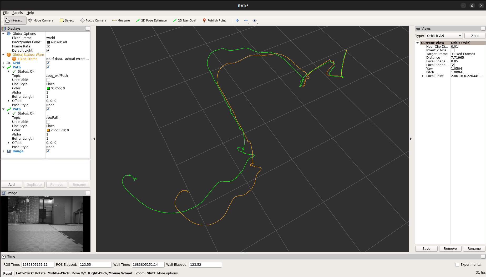

# ELEC5660 Project 3 Phase 3 Report
LIANG, Yuchen Eric (20582717)

## Video demonstration

Video can be found using [this link](https://hkustconnect-my.sharepoint.com/:v:/g/personal/yliangbk_connect_ust_hk/ES41RdWWiD1BrLjjaX8qIqMBo2O5OA5zVYy_ylGkNCdoaA?e=7Uh2Lu).

## Figures plotted by rqt plot and rviz
We use A mode to fly the plane and record a bag and tuned it on our own computer. Below is the output of running our bag. Bags can be found using [this link](https://hkustconnect-my.sharepoint.com/:f:/g/personal/yliangbk_connect_ust_hk/EtrhAOyz79tHjMCFhGcVOSQBaDIjO6kzQLXoFScIGchzCQ?e=PYoyM6).

## Descriptions about your implementation
#### Trajectory generation
The trajectory is generated using matlab A-star code in project 1 phase 4, we fine tune the path and the obstacle position a little (did not strictly followed the guide line). We give more spaces between the wall and camera to avoid crash of aug-EKF. The parameter is put inside the P.txt and t.txt and is read buy the traj_generator python file. The trajectory is hardcode into the plane, it is not doing realtime planning.

#### Augmented EKF and stereo VO
We did not use tag as a reference, therefore we remove PNP related code from the algorithm. But bugs are found in predictIMU function. It seems that in previous project phase, the aug_ekf is not crashed because the tag detector drag the odometry bag though the imu data is not processed properly. The aug_ekf is still not robust enough, but it works for one time, while we also need to . 

## others
#### Bugs
There are a lot of bugs during our implementation, here we will select some significant ones to talk about.
- Aug_ekf is not robust enough, the algorithm will crash for example: when you start your plane on the ground (significant numbers of feature point lost on the ground), or when the camera is too close to a surface (like the wall). We did not solve it, we just test it for many times and it works for one time.
- Mechanical bugs and hardware bugs should be aware of through out the whole time. Occasions like the motor mounting screw is loosen due to vibration and port is not properlly pluged can be very annoying and causing you time to trying to find bugs on your code. 

